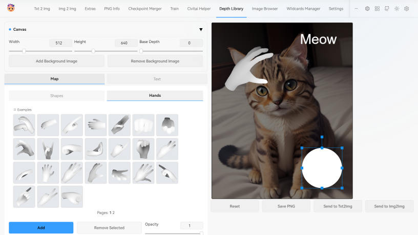

The is a fork from the [original repo by jexom](https://github.com/jexom/sd-webui-depth-lib) as that seems to be abandoned and not maintained now.

Many features/fixes have since been added. See the [closed PRs](https://github.com/wywywywy/sd-webui-depth-lib/pulls?q=is%3Aclosed) for a full list.

# Depth map library and poser

Depth map library for use with the [ControlNet extension](https://github.com/Mikubill/sd-webui-controlnet) for [Automatic1111/stable-diffusion-webui](https://github.com/AUTOMATIC1111/stable-diffusion-webui)

## Installation

1. Open the "Extensions" tab
2. Click on "Install from URL"
3. In "URL for extension's git repository" enter this extension, https://github.com/wywywywy/sd-webui-depth-lib.git
4. Click "Install"
5. Restart WebUI

## Adding own maps

To add own depth maps, put them in the `extensions/sd-webui-depth-lib/maps/<category>` folder, where `<category>` is a folder with the name of the category tab. See the example `shapes` folder.

## Attention

You must select "**None**" for the Preprocessor in ControlNet.
